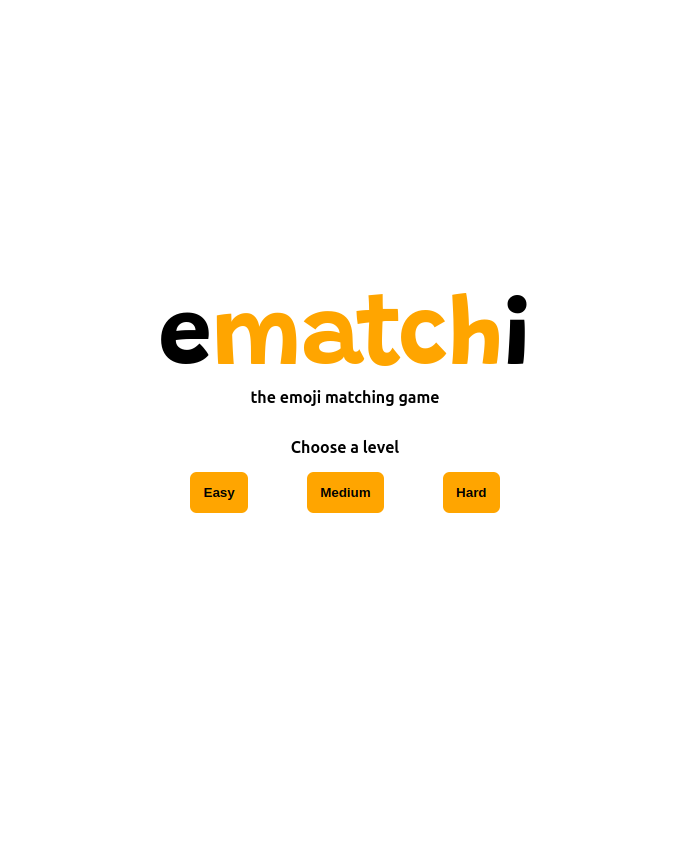
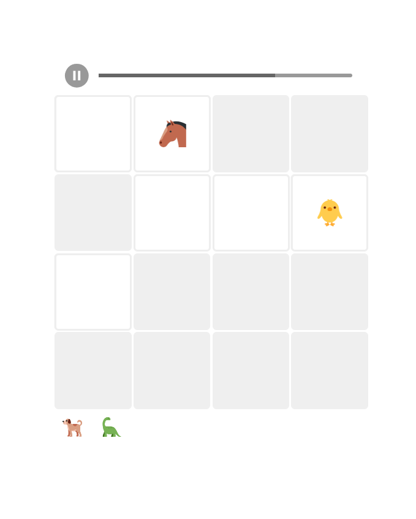
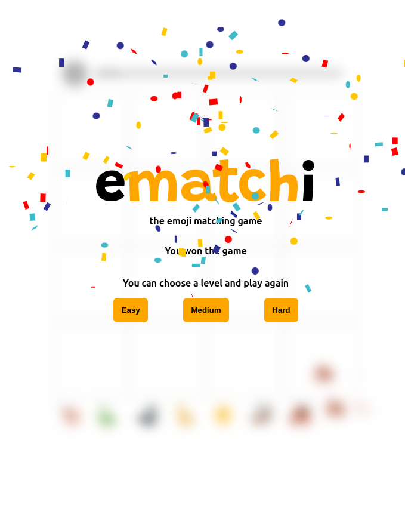

# Ematchi - the emoji amtching game

This is a project from Svelte course on FrontendMasters

It's a game where your goal is to find all pairs in a grid of covered cards


<div>
    
    
    
</div>


## Building

Once you've created a project and installed dependencies with `npm install` (or `pnpm install` or `yarn`), start a development server:

```bash
npm run dev

# or start the server and open the app in a new browser tab
npm run dev -- --open
```
